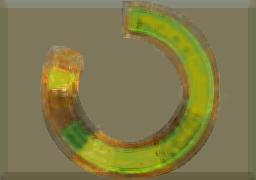

# autoencoder-de-colour-clock

## About the project
As part of CMPM 202, we are working on modifying an autoencoder that takes in images of colour clocks and produces some output image. The autoencoder uses TensorFlow and trains on a set of image files (ground truth) and color clocks generated from the ground truth images, and then attempts to reconstruct the original image from images of colour clocks.

Colour clocks were created using `colour-clock.py` at https://github.com/hugovk/pixel-tools

Original autoencoder code provided by https://github.com/manumathewthomas

## Some results
Ground truth:  

Generated colour clock:  

We use the generated color clock to try to generate the original ground truth image:

Output for Model 1 (100,000 iterations, batch size = 5):  

Output for Model 2 (200,000 iterations, batch size = 20):  

Another attempt -- using a different generated colour clock image with the original ground truth image as background.

Generated color clock:  

Output for Model 3 (100,000 iterations, batch size = 50):  

## How to run it yourself
### Create colour clocks
You can run `pixel-tools/colour_clock.py` on a set of images in order to create images of the corresponding colour clock. The output will have the same name as the original image. Width, height, and extension of the output file can be tweaked in the file.

To run the colour_clock function over every image in a given directory, use the command `python colour_clock.py [PATH/TO/IMG_FOLDER]`

### Update training data
Replace images in the `dataset` folder with the relevant images for training.

### Train model
You can find the parameters for the autoencoder in the `Autoencoder` folder. Delete the existing `Graphs` and `Checkpoints` folders if they are in the directory. Then run `python train.py`.

### Look at results
You can find the results of training in the `validation_results` folder. You can also run the autoencoder on another image with the command `python test.py [NAME_OF_IMG]`.

## Contributors
Mirek Stolee - https://github.com/mirekjames  
Devi Acharya - https://github.com/dacharya64
